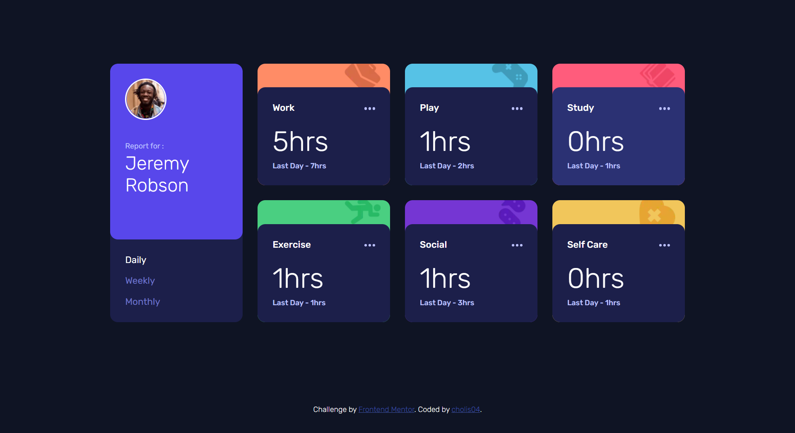

# Frontend Mentor - Time tracking dashboard solution

This is a solution to the [Time tracking dashboard challenge on Frontend Mentor](https://www.frontendmentor.io/challenges/time-tracking-dashboard-UIQ7167Jw). Frontend Mentor challenges help you improve your coding skills by building realistic projects.

## Table of contents

- [Overview](#overview)
  - [The challenge](#the-challenge)
  - [Screenshot](#screenshot)
  - [Links](#links)
- [My process](#my-process)
  - [Built with](#built-with)
- [Author](#author)
- [Acknowledgments](#acknowledgments)

## Overview

### The challenge

Users should be able to:

- View the optimal layout for the site depending on their device's screen size
- See hover states for all interactive elements on the page
- Switch between viewing Daily, Weekly, and Monthly stats

### Screenshot

### Links

- Live Site URL: [https://time-tracking-dashboard-fem.web.app/](https://time-tracking-dashboard-fem.web.app/)
- Repository URL: [https://github.com/cholis04/Time-Tracking-Dashboard](https://github.com/cholis04/Time-Tracking-Dashboard)

## My process

### Built with

- [React](https://reactjs.org/) - JS library
- [Gatsby](https://www.gatsbyjs.com/) - React framework
- [Styled Components](https://styled-components.com/) - For styles
- Desktop-first workflow
- Flexbox
- CSS Grid
- [React CountUp](https://www.npmjs.com/package/react-countup/) - Create animations that display numerical data
- GraphQL

## Author

- Website - [https://cholis04.github.io](https://cholis04.github.io)
- Frontend Mentor - [@cholis04](https://www.frontendmentor.io/profile/cholis04)
- Dribbble - [cholis04](https://dribbble.com/cholis04)
- Instagram - [@cholis04](https://instagram.com/cholis04)
- Codepen - [cholis04](https://codepen.io/cholis04)

## Acknowledgments

Thanks to anyone who provided feedback.
